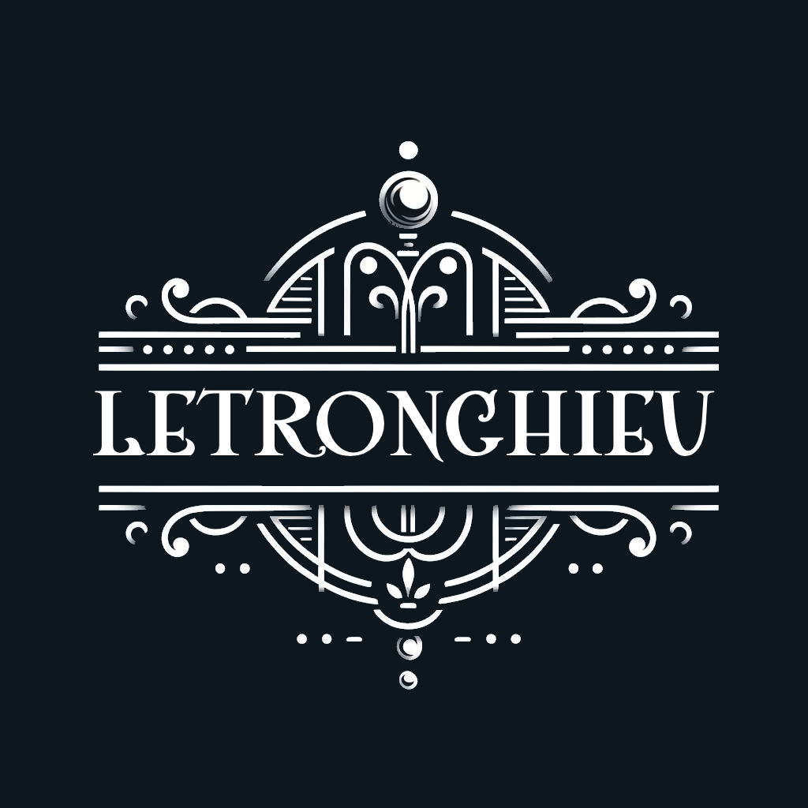
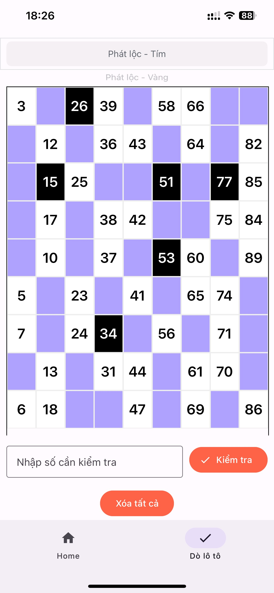
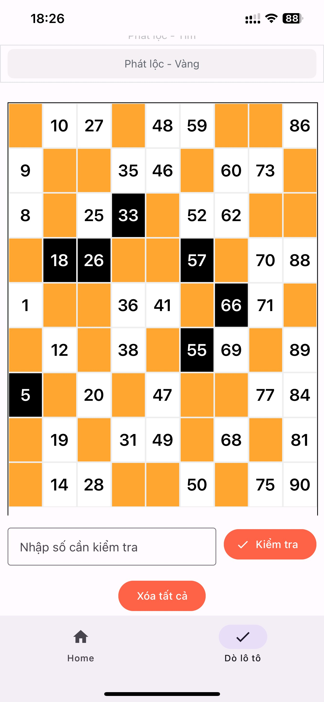

<!-- Improved compatibility of back to top link: See: https://github.com/othneildrew/Best-README-Template/pull/73 -->

<!-- PROJECT LOGO -->
 

    

<!-- ABOUT THE PROJECT -->
## About The Project

    
    

- 🔭 Dò số Lô tô 

### 🛠️ Tech stack

